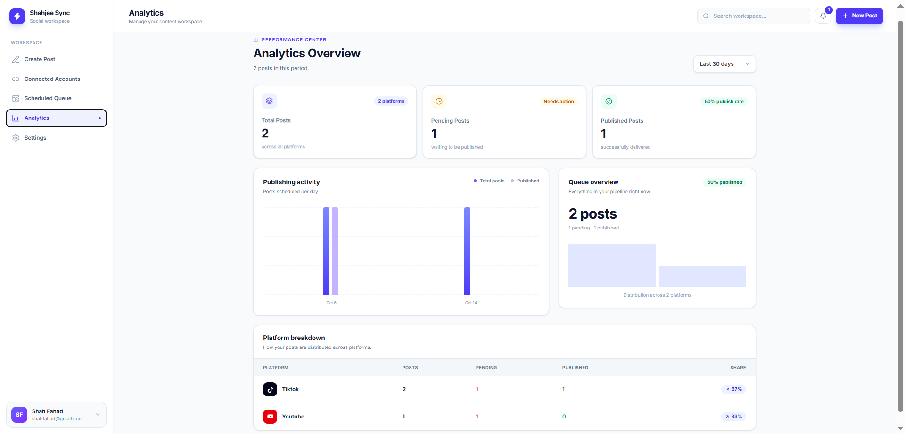

# ⚡ Shahjee Sync

### One workspace. Every platform.

*A modern social media management dashboard — create once, schedule smart, grow fast.*

🌐 **Live Demo:** [https://shahjee-sync.vercel.app](https://shahjee-sync.vercel.app)

---

## 📸 Screenshots

### Landing Page

### Create Post — with live phone preview

### Scheduled Queue — manage your entire pipeline

### Analytics — real numbers from your own workspace

### Landing Page — bottom section

---

## ✨ Features

### 🎨 Landing & Auth

- **Premium landing page** — animated hero, live dashboard preview, testimonials & FAQ
- **Secure authentication** — signup / login / logout
- **Multi-user support** — every user gets a completely private workspace

### 📝 Content Creation

- **Smart post composer** — drag & drop media, captions with character counter
- **Live phone preview** — see your post exactly how followers will see it
- **AI caption suggestions** — one-click caption ideas
- **Draft autosave** — your work survives page refreshes
- **Image compression** — uploads auto-optimized for fast saving

### 📅 Scheduling & Queue

- **Visual content calendar** — full month view, hover a date to schedule instantly
- **Scheduled queue** — search, filter, and sort your pipeline
- **Bulk actions** — select multiple posts, delete in one go
- **Undo delete** — 6-second window to restore anything, nothing lost by accident
- **Duplicate posts** — reuse your best content in one click
- **Edit & reschedule** — update titles, dates and times anytime

### 📊 Insights & Management

- **Dynamic analytics** — real stats from your own posts, with 7/30/90-day filters
- **Platform breakdown** — see exactly where your content performs
- **Notification center** — activity feed with unread badge
- **Account hub** — connect/disconnect 6 platforms with platform locking
- **Data backup** — export / import your entire workspace as JSON

---

## 🖥️ Supported Platforms

| Platform | Status |
|----------|--------|
| Instagram | ✅ |
| YouTube | ✅ |
| Facebook | ✅ |
| TikTok | ✅ |
| LinkedIn | ✅ |
| X | ✅ |

---

## 🛠️ Tech Stack

- **React 19** — UI framework
- **TypeScript** — type-safe code
- **Vite** — lightning-fast build tool
- **Tailwind CSS** — modern styling
- **Lucide Icons** — clean iconography

---

## 🚀 Getting Started

    # Clone the repository
    git clone https://github.com/fahad12272/shahjee-sync.git

    # Install dependencies
    pnpm install

    # Start the development server
    pnpm dev

Then open http://localhost:5173 in your browser.

---

## 🎯 How It Works

1. **Create your account** — sign up in seconds with just your name, email & password
2. **Connect your platforms** — pick the social accounts you publish to
3. **Schedule & grow** — create posts, queue them up, watch your analytics grow

---

## 🗺️ Roadmap

- [ ] Cloud sync with real database (login from any device)
- [ ] Real social publishing via official OAuth APIs (Meta, TikTok)
- [ ] Team workspaces & shared queues
- [ ] Dark mode
- [ ] Best-time-to-post suggestions

---

## 👤 Author

**Shah Fahad** — Creator & Developer

Designed & built with ❤️

---

⭐ **Star this repo if you like the project!**

© 2025 Shah Fahad · Shahjee Sync. All rights reserved.
